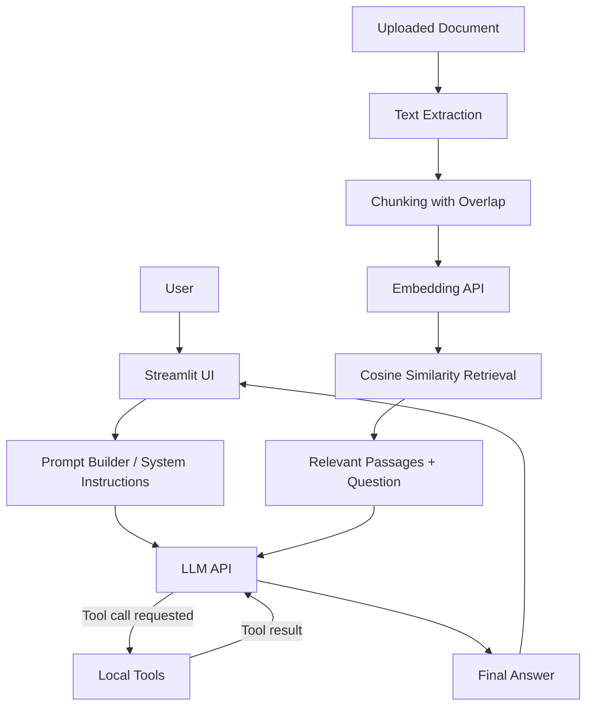

# Architecture Diagram (Mermaid)

```mermaid
flowchart TD
    U[User] --> UI[Streamlit UI]
    UI --> P[Prompt Builder / System Instructions]
    P --> L[LLM API]
    L -->|Tool call requested| T[Local Tools]
    T -->|Tool result| L
    L --> A[Final Answer]
    A --> UI

    D[Uploaded Document] --> E[Text Extraction]
    E --> C[Chunking with Overlap]
    C --> V[Embedding API]
    V --> R[Cosine Similarity Retrieval]
    R --> X[Relevant Passages + Question]
    X --> L
```
